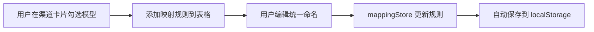
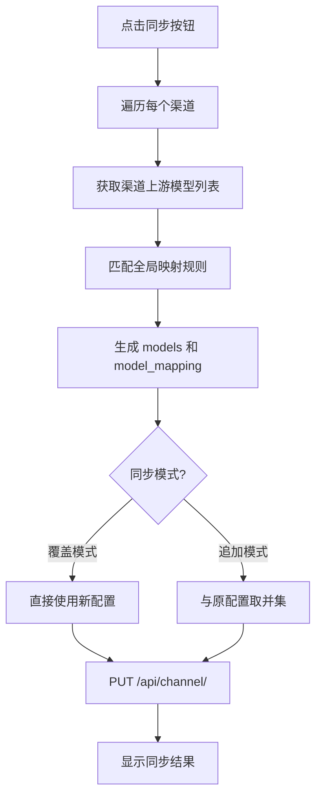

# New-API 重定向配置工具 - 实现方案

## 项目概述

本工具用于简化 New-API 渠道模型的重定向配置，将不同渠道中命名不同但本质相同的模型统一映射为标准命名格式。

---

## 一、整体架构

```
┌─────────────────────────────────────────────────────────────┐
│                        Vue 3 + Vite                         │
├─────────────────────────────────────────────────────────────┤
│  Views (页面)                                                │
│  ┌─────────────┐  ┌─────────────────┐  ┌────────────────┐  │
│  │  Settings   │  │  RedirectMap    │  │     Sync       │  │
│  │   设置页    │  │   映射配置页     │  │    同步页      │  │
│  └─────────────┘  └─────────────────┘  └────────────────┘  │
├─────────────────────────────────────────────────────────────┤
│  Stores (状态管理 - Pinia)                                   │
│  ┌─────────────┐  ┌─────────────────┐  ┌────────────────┐  │
│  │ configStore │  │  channelStore   │  │  mappingStore  │  │
│  │  配置信息   │  │   渠道信息       │  │   映射规则     │  │
│  └─────────────┘  └─────────────────┘  └────────────────┘  │
├─────────────────────────────────────────────────────────────┤
│  API Layer (接口层)                                          │
│  ┌─────────────────────────────────────────────────────────┐│
│  │  channel.ts - 渠道相关 API                               ││
│  └─────────────────────────────────────────────────────────┘│
└─────────────────────────────────────────────────────────────┘
```

---

## 二、页面设计

### 2.1 设置页面 (Settings View)

**功能**：配置 API 连接信息

| 字段 | 类型 | 说明 |
|------|------|------|
| baseUrl | string | New-API 服务地址 |
| token | string | Bearer Token |
| userId | string/number | 用户 ID（New-Api-User 请求头） |

**存储**：配置保存到 `localStorage`，应用启动时自动加载

---

### 2.2 重定向映射页面 (RedirectMap View)

**页面布局**：

```
┌─────────────────────────────────────────────────────────────┐
│  映射规则表                                                  │
│  ┌────────────────────────┬────────────────────────────────┐│
│  │      原模型名           │         统一命名               ││
│  ├────────────────────────┼────────────────────────────────┤│
│  │  gpt-4-turbo-preview   │  gpt-4-turbo                   ││
│  │  gpt-4-0125-preview    │  gpt-4-turbo                   ││
│  │  claude-3-opus-latest  │  claude-3-opus                 ││
│  └────────────────────────┴────────────────────────────────┘│
├─────────────────────────────────────────────────────────────┤
│  渠道列表 (可折叠卡片)                                       │
│  ┌───────────────────────────────────────┐                  │
│  │ ▼ 渠道名称: OpenAI-1    状态: ✅ 正常  │                  │
│  │   ┌─────────────────────────────────┐ │                  │
│  │   │ ☑ gpt-4-turbo-preview           │ │                  │
│  │   │ ☑ gpt-4-0125-preview            │ │                  │
│  │   │ ☐ gpt-3.5-turbo                 │ │                  │
│  │   └─────────────────────────────────┘ │                  │
│  └───────────────────────────────────────┘                  │
│  ┌───────────────────────────────────────┐                  │
│  │ ▶ 渠道名称: Claude-API  状态: ✅ 正常  │                  │
│  └───────────────────────────────────────┘                  │
└─────────────────────────────────────────────────────────────┘
```

**交互逻辑**：
1. 点击渠道卡片展开，显示该渠道可用的模型列表
2. 勾选模型后，自动在上方映射规则表中添加条目
3. 用户可以编辑统一命名列

---

### 2.3 同步页面 (Sync View)

**功能**：将配置好的映射规则同步到 New-API

**页面元素**：
- 同步模式选择（滑块/开关）
  - **追加模式**：保留渠道原有 model_mapping，追加新规则
  - **覆盖模式**：完全替换渠道的 model_mapping
- 同步按钮
- 同步状态/日志显示区域

---

## 三、全局状态设计 (Pinia Stores)

### 3.1 configStore - 配置信息

```typescript
interface ConfigState {
  baseUrl: string;     // API 基础地址
  token: string;       // Bearer Token
  userId: string;      // 用户 ID
}
```

**持久化**：保存到 localStorage

---

### 3.2 channelStore - 渠道信息

```typescript
interface Channel {
  id: number;
  name: string;
  status: number;              // 1=启用
  models: string;              // 当前启用的模型（逗号分隔）
  model_mapping: string;       // 当前的映射配置（JSON 字符串）
  upstreamModels?: string[];   // 上游模型列表（通过 fetch_models 获取）
}

interface ChannelState {
  channels: Channel[];
  loading: boolean;
  error: string | null;
}
```

**Actions**:
- `fetchChannels()` - 获取所有渠道
- `fetchUpstreamModels(channelId)` - 获取指定渠道的上游模型列表
- `updateChannelMapping(channelId, mapping)` - 更新渠道的 model_mapping

---

### 3.3 mappingStore - 映射规则

```typescript
interface MappingRule {
  sourceModel: string;    // 原模型名
  targetModel: string;    // 统一命名
  channelIds: number[];   // 关联的渠道 ID
}

interface MappingState {
  rules: MappingRule[];
  syncMode: 'append' | 'overwrite';  // 同步模式
}
```

**持久化**：保存到 localStorage

---

## 四、API 接口封装

基于现有 API 文档，需要封装以下接口：

### 4.1 获取所有渠道
```typescript
// GET /api/channel/
// Headers: Authorization: Bearer {token}, New-Api-User: {userId}
function getChannels(): Promise<ChannelListResponse>
```

### 4.2 获取上游模型列表
```typescript
// GET /api/channel/fetch_models/{id}
function fetchUpstreamModels(channelId: number): Promise<string[]>
```

### 4.3 更新渠道
```typescript
// PUT /api/channel/
// Body: { id: number, model_mapping: string }
function updateChannel(channelId: number, modelMapping: string): Promise<void>
```

---

## 五、数据流设计

### 5.1 映射规则生成流程



### 5.2 同步流程

**核心逻辑**：PUT 请求需要更新两个字段

| 字段 | 说明 |
|------|------|
| `models` | 重定向后的统一命名列表（逗号分隔） |
| `model_mapping` | 原模型名 → 统一命名的映射规则（JSON 字符串） |

**同步算法**：

1. 遍历每个渠道，获取其上游模型列表 `upstreamModels`
2. 将 `upstreamModels` 与全局映射规则 `rules` 匹配
3. 找出该渠道拥有的模型，生成：
   - `models`: 匹配到的模型重定向后的统一命名（去重）
   - `model_mapping`: `{ "原模型名": "统一命名", ... }`
4. 根据同步模式处理：
   - **覆盖模式**：直接使用新生成的 `models` 和 `model_mapping`
   - **追加模式**：将新 `models` 与原 `models` 取并集，`model_mapping` 合并（新规则优先）



**示例**：

假设渠道上游模型为 `["gpt-4-turbo-preview", "gpt-4-0125", "gpt-3.5-turbo"]`

全局映射规则为：
- `gpt-4-turbo-preview` → `gpt-4-turbo`
- `gpt-4-0125` → `gpt-4-turbo`

匹配后生成：
```json
{
  "id": 1,
  "models": "gpt-4-turbo,gpt-3.5-turbo",
  "model_mapping": "{\"gpt-4-turbo-preview\":\"gpt-4-turbo\",\"gpt-4-0125\":\"gpt-4-turbo\"}"
}
```

---

## 六、目录结构规划

```
src/
├── api/
│   ├── channel.ts          # 渠道相关 API
│   └── types.ts             # API 类型定义
├── stores/
│   ├── config.ts            # 配置 store
│   ├── channel.ts           # 渠道 store
│   └── mapping.ts           # 映射规则 store
├── views/
│   ├── SettingsView.vue     # 设置页面
│   ├── RedirectMapView.vue  # 重定向映射页面
│   └── SyncView.vue         # 同步页面
├── components/
│   ├── ChannelCard.vue      # 渠道卡片组件
│   ├── MappingTable.vue     # 映射规则表格组件
│   └── NavBar.vue           # 导航栏组件
├── router/
│   └── index.ts             # Vue Router 配置
└── App.vue
```

---

## 七、需要安装的依赖

```bash
pnpm add vue-router@4 pinia pinia-plugin-persistedstate
```

| 依赖 | 用途 |
|------|------|
| vue-router | 页面路由 |
| pinia | 状态管理 |
| pinia-plugin-persistedstate | 状态持久化到 localStorage |

---

## 八、方案评估

### ✅ 优点

1. **结构清晰**：三页面分工明确，设置/配置/执行各司其职
2. **状态管理合理**：使用 Pinia 管理全局状态，支持持久化
3. **容错设计**：上游模型拉取失败时可回退到当前启用模型
4. **灵活的同步模式**：追加/覆盖两种模式满足不同需求

### ⚠️ 需要注意

1. **分页处理**：获取渠道接口有分页，需要处理多页数据
2. **错误处理**：需要完善 API 调用的错误处理和用户提示
3. **映射冲突**：同一模型被映射到多个目标时需要提示用户

### 💡 建议补充

1. 添加「一键刷新所有渠道上游模型」的功能
2. 添加「预览同步结果」功能，在实际同步前展示将要写入的配置
3. 考虑添加映射规则的导入/导出功能

---

## 九、实现计划

| 阶段 | 内容 | 预计工作量 |
|------|------|------------|
| 1 | 安装依赖、配置路由和 Pinia | 小 |
| 2 | 实现 API 层和 Stores | 中 |
| 3 | 实现设置页面 | 小 |
| 4 | 实现重定向映射页面 | 大 |
| 5 | 实现同步页面 | 中 |
| 6 | 样式优化和测试 | 中 |

---

## 十、验证计划

### 手动测试步骤

1. **设置页面测试**
   - 输入 baseUrl、token、userId，刷新页面确认数据保留
   
2. **映射配置测试**
   - 点击渠道卡片展开
   - 勾选模型，确认映射表更新
   - 编辑统一命名，确认保存正常

3. **同步测试**
   - 选择追加/覆盖模式
   - 点击同步按钮
   - 在 New-API 后台验证 model_mapping 是否正确更新
